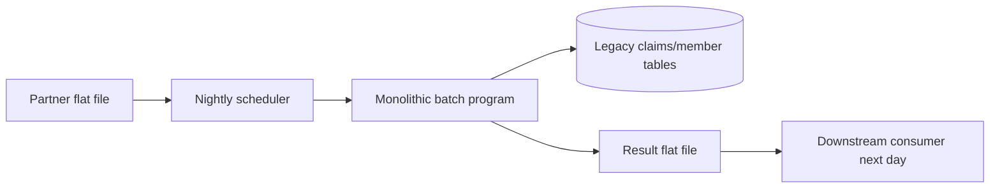
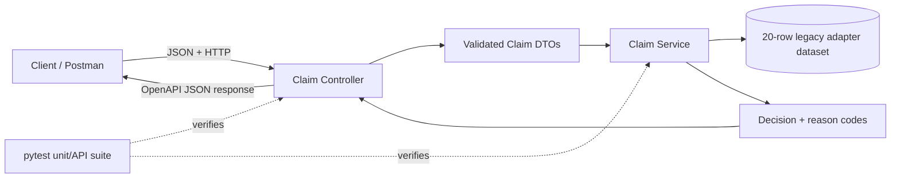

# Architecture: Batch to REST

## Before — tightly coupled overnight batch

Characteristics: file-level failure, delayed feedback, implicit field
contracts, and business rules mixed with transport and persistence logic.

## After — synchronous, layered REST service

The controller owns HTTP concerns, DTOs own contract validation and
normalization, and the service owns deterministic business decisions. The JSON
adapter can later be replaced by a repository/database adapter without changing
the public contract or decision rules.

## Operational flow

`Validate → detect duplicate → verify eligibility → enforce limit → approve`

This design enables immediate decisions, isolated unit tests, OpenAPI-driven
integration, machine-readable failure reasons, and incremental replacement of
the legacy data source.
